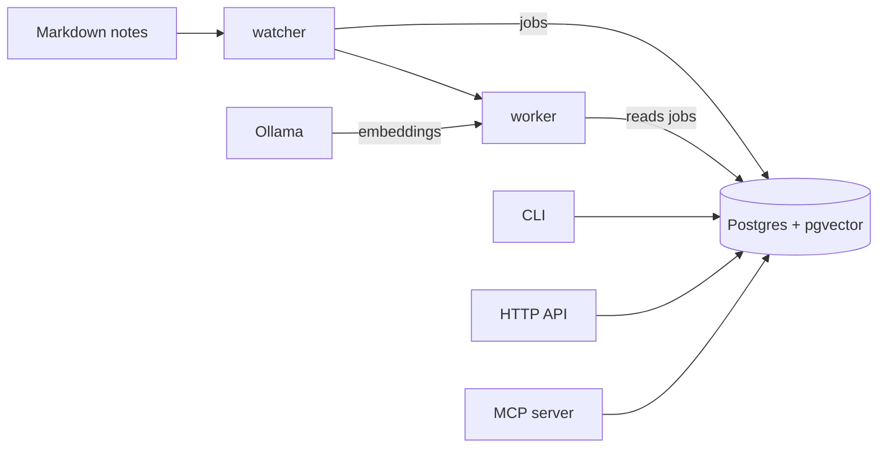
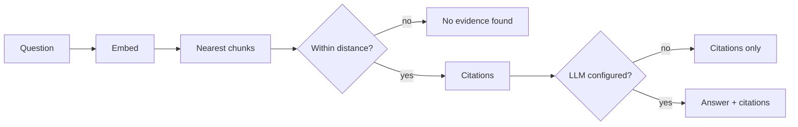

# knowman

Ask questions about your own Markdown notes and get answers that cite the exact file and lines they came from.

Notes pile up and stop being read. `grep` doesn't answer "what did we decide about X, and where is it written?", and a chat assistant without sources will happily invent one. knowman indexes a folder of `.md` files, answers from that folder only, and shows the evidence — when it finds nothing, it says so instead of guessing.

It runs entirely on your machine: Postgres with pgvector for the index, Ollama for embeddings, no API key required.

## What it looks like

Search returns the passages themselves, with line ranges:

```
$ knowman search "why Postgres"
decision-log.md:L5-L5
  We chose Postgres with the pgvector extension for the vector store.
architecture-notes.md:L5-L6
  The store module is the only part of the codebase that speaks SQL.
Every other module calls its functions instead of touching Postgres directly.
decision-log.md:L1-L3
  # Decision log

## Database engine
```

Ask nothing the notes cover, and the answer is a negative, not a guess:

```
$ knowman search "capital of mongolia"
No evidence found for that query.
```

With a language model configured, `ask` writes prose grounded in those same passages and prints them underneath (this run used Ollama with `qwen3.5:2b`; smaller local models hedge more):

```
$ knowman ask "what is the store module responsible for?"
The store module is responsible for speaking SQL, being the only part of the
codebase that interacts with Postgres directly, while every other module uses
its functions to interact with the database.

Sources:
architecture-notes.md:L1-L3
  # Architecture notes

## Store module
architecture-notes.md:L5-L6
```

Retrieval quality is measured, not assumed. A labeled dataset scores how often the right source is cited, with no model judging the result:

```
$ knowman eval
groundedness: 100.00% (25/25), delta: +0.00%
```

## Getting started

Requires Docker and the Docker Compose plugin. Nothing else — no Python on the host.

```bash
git clone https://github.com/radorta27/knowman
cd knowman
./install.sh
```

The script checks its prerequisites, tells you exactly how to fix anything missing, and stops rather than installing anything with elevated privileges. Then it builds the stack, pulls the embeddings model, indexes the sample notes in `corpus/dummy/`, and confirms a real search returns a real citation.

If your machine exposes a GPU at `/dev/dri`, it enables Vulkan acceleration; otherwise everything runs on CPU without any configuration.

Once it finishes:

```bash
docker compose exec api knowman search "why Postgres"
```

## Use your own notes

Point `CORPUS_PATH` at your own folder and mount it instead of the sample one:

```bash
cp .env.example .env
```

```diff
- CORPUS_PATH=corpus/dummy
+ CORPUS_PATH=/notes
```

```diff
  api:
    volumes:
-     - ./corpus/dummy:/corpus
+     - /home/you/notes:/notes
```

Then re-index once:

```bash
docker compose up -d
docker compose exec api knowman ingest
```

From there the watcher keeps the index in step: add, edit, or delete a `.md` file and the change is reflected without running anything by hand.

## How it works



A note is split into chunks at blank lines, each chunk keeping the line range it came from. Each chunk is embedded and stored. That line range is what makes a citation exact.

A question travels the same path in reverse:



Nothing is answered without evidence: if no chunk is close enough, the result is the explicit negative, and the language model is never called.

## Interfaces

The same logic is reachable three ways.

### CLI

| Command | What it does |
| --- | --- |
| `knowman db-init` | applies the schema, sizing the vector column to the configured embeddings model |
| `knowman ingest [--path DIR]` | indexes a directory or a single `.md` file |
| `knowman search <query> [--k N]` | returns citations, or the explicit negative |
| `knowman ask <query> [--k N]` | same, plus a generated answer when a language model is configured |
| `knowman eval` | scores the labeled dataset and reports the change since the last run |
| `knowman worker` | runs the job worker in the foreground |
| `knowman watch [--path DIR]` | runs the folder watcher in the foreground |
| `knowman mcp` | runs an MCP server over stdio |
| `knowman write <instruction>` | an agent that can search the notes and write a new one, in natural language |

### HTTP

Interactive OpenAPI at `http://localhost:8000/docs`.

| Endpoint | What it does |
| --- | --- |
| `GET /health` | liveness, without touching the database |
| `GET /search?q=&k=` | `{"citations": [...]}`, empty when there is no evidence |
| `POST /ask` | `{"q": str, "k": int?}` → `{"citations": [...], "answer": str \| null}`; `answer` is `null` without evidence or without a configured provider |
| `GET /eval` | runs the dataset now and returns groundedness, its delta, and the failing questions |
| `GET /eval/history?limit=` | past eval runs, newest first |
| `POST /index` | enqueues an indexing job, returns `{"job_id": N}` (202) |
| `GET /index/{id}` | job status: `pending` / `processing` / `done` / `failed` |

### MCP

`knowman mcp` serves two read-only tools, `search` and `ask`, over stdio — the same contract as their CLI and HTTP counterparts. An MCP client launches it as a local subprocess:

```json
{
  "mcpServers": {
    "knowman": {
      "command": "uv",
      "args": ["run", "--directory", "/path/to/knowman", "knowman", "mcp"]
    }
  }
}
```

## Services

`docker compose` runs five containers, four of them from the same image:

| Service | What it does |
| --- | --- |
| `db` | Postgres + pgvector |
| `ollama` | embeddings and local chat, in-container |
| `api` | FastAPI on `http://localhost:8000` |
| `worker` | runs queued indexing jobs |
| `watcher` | turns file changes into those jobs |

## Configuration

Copy `.env.example` to `.env`; Docker Compose reads it automatically. The settings that matter most:

| Variable | Default | What it is |
| --- | --- | --- |
| `CORPUS_PATH` | `corpus/dummy` | the folder that gets indexed and watched |
| `EMBEDDINGS_MODEL` | `qwen3-embedding:0.6b` | changing it requires `db-init` and a full re-index — a different model means a different vector space |
| `RETRIEVAL_MAX_DISTANCE` | `0.5` | beyond this distance, a chunk doesn't count as evidence |
| `RETRIEVAL_DEFAULT_K` | `3` | citations per query |
| `LLM_PROVIDER` | _(unset)_ | `ollama`, `claude`, `openai`, or `grok`; unset means retrieval only |
| `CHAT_MODEL` | `qwen3.5:0.8b` | the Ollama model used for answers |
| `AGENT_MODEL` | `qwen3.5:2b` | the Ollama model used by `knowman write`; it needs tool-calling support |
| `PROMPT_VERSION` | `ask_v1` | which file under `prompts/` shapes the answer — changing the wording means adding a file, not editing code |
| `ANTHROPIC_API_KEY` / `OPENAI_API_KEY` / `XAI_API_KEY` | _(none)_ | only needed for the matching provider |

Everything works with no key at all: retrieval, citations, and eval never depend on a paid provider.

## Architecture

- **`store`** — the only module that speaks SQL. Every query is parameterized; swapping the vector engine means rewriting this module alone.
- **`chunking` / `ingest`** — splits Markdown into citable chunks with line ranges, embeds them, and persists them.
- **`retrieval`** — embeds a query and keeps only what falls within the distance threshold; an empty result is the explicit negative.
- **`llm` / `ask`** — the provider interface (Ollama without a key; Claude, OpenAI, and Grok over plain HTTP, no vendor SDKs) and the three-state answer: no evidence, citations only, or citations plus a generated answer. Prompt text lives in `prompts/`, versioned by file, and every call is recorded with its citation count, latency, and approximate tokens.
- **`eval`** — scores a labeled dataset against retrieval; groundedness is a match rate, never a model judging another model. Each run is stored, so a regression is visible as a drop.
- **`agent`** — a LangGraph agent over Ollama with two tools: searching the notes, and writing a new one. A filename that would escape the corpus directory is rejected.
- **`worker` / `watcher`** — the watcher turns file events into jobs; the worker runs them.
- **`api` / `cli` / `mcp_server`** — three surfaces over one implementation.

## Security

- No query concatenates SQL; every value is a bound parameter.
- Every published port binds to `127.0.0.1`, so no service is reachable from the network.
- Containers run as an unprivileged user, built at the host's own UID so the notes folder stays writable without loosening permissions.
- The worker and the watcher mount the notes read-only; only the agent's write path needs write access.
- A failed job's raw exception never leaves the database — the API reports that it failed, not why.
- There is no authentication, deliberately, while nothing is exposed beyond localhost. That is revisited before anything is published to the internet.

## Not this

Not a note editor, not a wiki, not a wrapper around a single vendor's API. It reads a folder you already own and answers from it.

## Roadmap

- **Shipped** — indexing with citable line ranges, CLI, HTTP and MCP surfaces, a job queue and folder watcher, answers with a configurable provider, groundedness eval, and a note-writing agent.
- **Next** — a public demo URL on free-tier cloud infrastructure, with retrieval and citations working without any paid key.

## License

MIT. Copyright (c) 2026 rdorta27.
